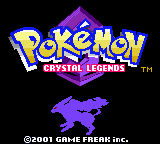
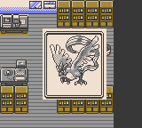
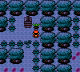
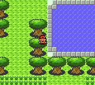

# Crystal Legends

**Begin your journey with a legend.**

Choose Articuno, Zapdos, or Moltres and rediscover Johto and Kanto in a custom
Pokémon Crystal adventure. Crystal Legends brings legendary Pokémon into the
heart of the journey, expands familiar stories, and gives every one of the
251 species an acquisition path on a single save.

Follow Team Rocket's research, discover new rewards in places you remember,
and take your team beyond the original League challenge—all in Crystal's
Game Boy Color world.

| A new beginning | A legendary partner |
| :---: | :---: |
|  |  |
| **Discover Johto's gifts** | **Explore the Safari preserve** |
|  |  |

## What awaits you

- **Start with Articuno, Zapdos, or Moltres.** Your choice also shapes Silver's
  legendary partner and the story that follows.
- **Uncover Project Mew.** Follow an expanded Rocket storyline, make a lasting
  choice, and discover a new chapter in Silver's journey.
- **Build a complete Pokédex on one save.** Single-player evolution methods,
  renewable evolution items, new encounters, and an in-game Celebi event remove
  the need for trading or external distributions.
- **Find more in familiar places.** Discover all three Johto starters in the
  world, earn Kanto starters through local services, explore the Safari
  preserve, and uncover new Ruins of Alph rewards.
- **Keep going after the League.** Restored Cerulean Cave, further legendary
  encounters, and an expanded ending give your team more to work toward.
- **Face reworked teams and progression.** Revised trainer parties and Kanto
  encounter levels carry the adventure through Johto, the League, and the
  postgame. Natural-play balance is still being refined.

## Build and play

Follow [INSTALL.md](INSTALL.md) to install the tools, build the game, and open
it in a Game Boy Color emulator. Once the prerequisites are ready:

```bash
git clone https://github.com/jsie7/crystal-legends.git
cd crystal-legends
make crystallegends
```

The game is **`crystallegends.gbc`**. The source build assembles the ROM directly;
it does not require an original ROM as input.

## Development status

The core gameplay additions are implemented and covered by automated checks.
Playtesting continues across natural progression, balance, alternate story
branches, and a complete single-save Pokédex run. See [project status](docs/status.md)
for the current acceptance boundaries and [manual playtesting](docs/playtesting.md)
for ways to help. This is an in-development build.

<a id="see-also"></a>

## Guides and contributing

| Looking for… | Start here |
| --- | --- |
| Setup and playing the game | [Build and play](INSTALL.md) |
| Build errors and editing questions | [FAQ](FAQ.md) |
| Where to find every species | [Acquisition ledger](docs/pokemon-acquisition.md) — **spoilers** |
| Trainer and encounter changes | [Balance guide](docs/phase-12-balance.md) — **spoilers** |
| Source layout and development guides | [Documentation](docs/README.md) |
| Automated validation | [Test guide](tests/README.md) |

The story decisions and playtest checklists also contain spoilers.

Report problems in [this repository's issue tracker](https://github.com/jsie7/crystal-legends/issues).
Include the source commit or ROM hash, emulator/version, steps to reproduce,
and expected versus observed behavior. For gameplay issues, name the relevant
starter branch and whether the save came from ordinary play or a prepared
checkpoint.

For code changes, read [the repository guide](docs/repository-guide.md),
[style conventions](STYLE.md), and [validation workflows](docs/workflows.md).

## Credits and source

Crystal Legends is built from [pret/pokecrystal](https://github.com/pret/pokecrystal),
the Pokémon Crystal disassembly. Its contributors made this source-based custom
game possible. The original game and artwork are by Game Freak and Nintendo;
Giovanni's imported artwork comes from
[pret/pokered](https://github.com/pret/pokered), with provenance in the
[asset guide](docs/assets.md).

The [upstream wiki](https://github.com/pret/pokecrystal/wiki),
[pret community](https://discord.gg/d5dubZ3), and
[RGBDS tools](https://github.com/gbdev/rgbds) remain useful development resources.
Original-ROM targets are retained for regression checks; see the
[build target reference](docs/repository-guide.md#build-targets-and-validation).
